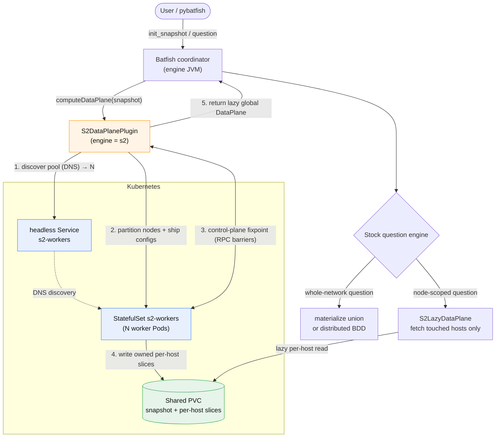

# S2 × Kubernetes: query flow

How a normal Batfish query is served by the S2 distributed engine on Kubernetes. **Control plane**
(the BGP/OSPF fixpoint) is live RPC between the engine and the worker pool; the **data plane**
(per-host RIB/FIB/forwarding slices) is written to shared storage and read lazily, so the global
data plane never has to fit in one JVM.

- **Control plane = live RPC.** The fixpoint reuses the runner's controller/sidecar protocol
  (`S2ControlMessages` / `S2ControllerServer` / `S2SidecarServer`); the in-process `S2Cluster`
  barriers become a network `S2Coordinator`.
- **Data plane = per-host slices.** Each worker writes its owned nodes' slices to the shared PVC
  (one block per host, the same granularity as `PerHostDataPlane`); `S2LazyDataPlane` reads a host on
  demand (LRU).
- **Scaling.** `kubectl scale statefulset/s2-workers --replicas=N`; the engine uses
  `N = min(pool size, node count)` (`s2workers=0` = auto).
- **Failure/consistency.** A worker dying mid-fixpoint fails that run (retry); slices are keyed by
  snapshot id, so a version is pinned.
